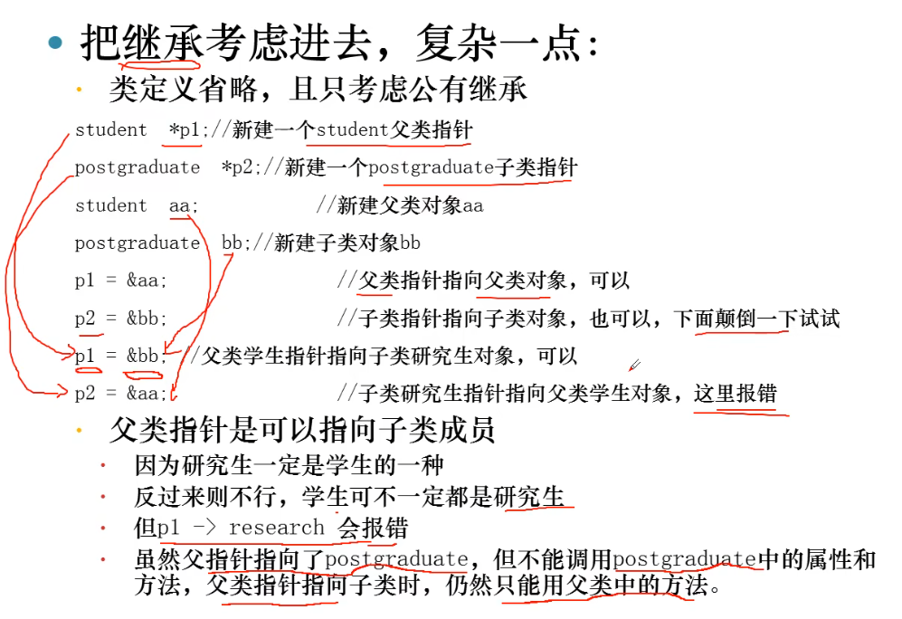
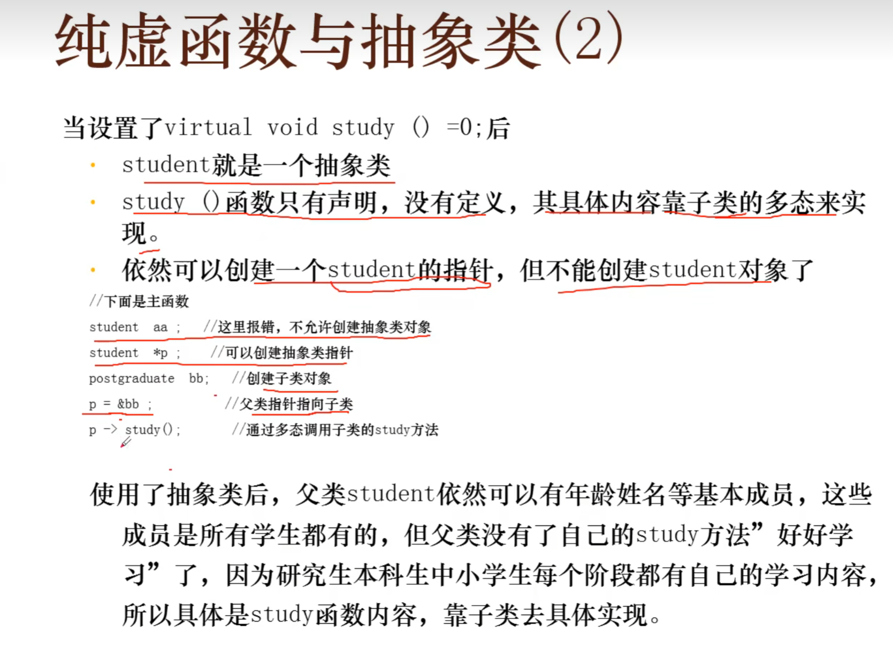
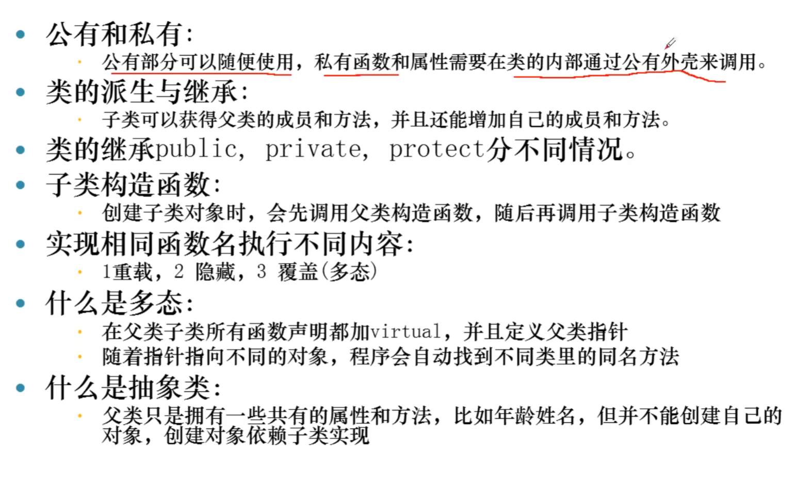
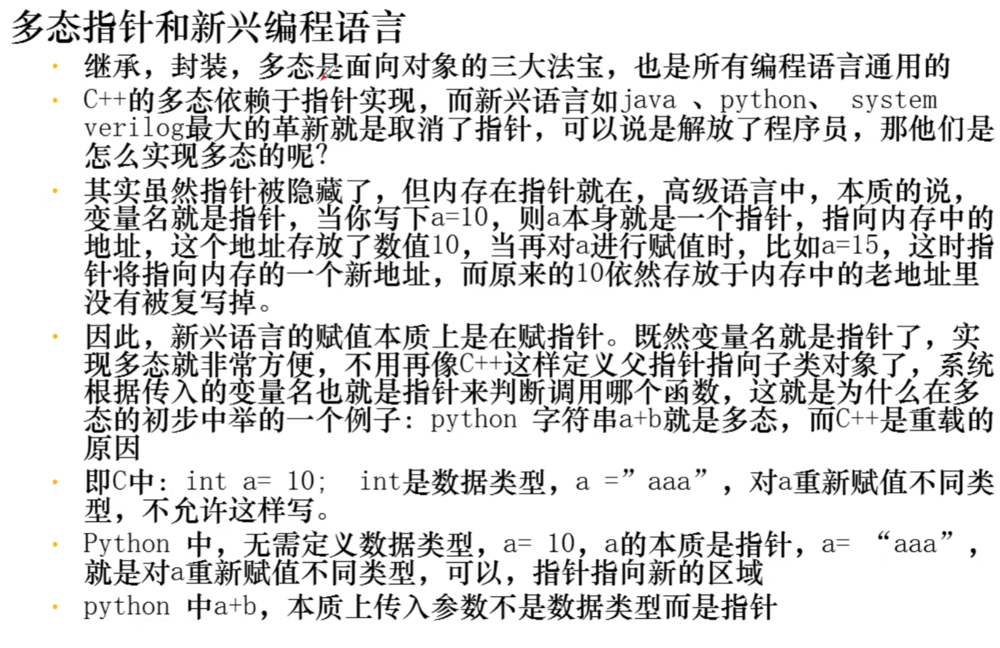

阶段总结（2）
- 第二阶段讲了类的成员函数, 又叫方法:
1 普通成员函数
bool student::set(int a)
2构造函数, 自动初始化对象
3 帯参数的构造函数, 动态初始化对象
student:: student (int a, string b)
4 析构函数，销毁对象
5 常成员函数, 只读不写
bool student::read() const 静态成员函数, 依赖于类, 但不依赖于某个对
吏
static int count $\zeta$

## 类的成员函数


## 类的指针



纯虚函数：

```cpp
virtual void study() = 0;
```





