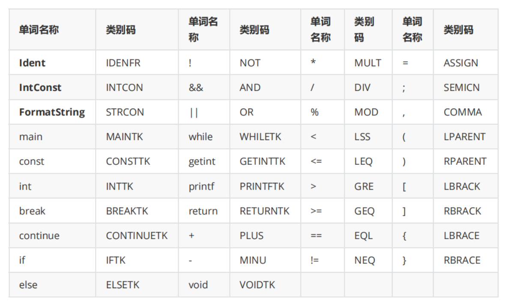

* UnaryExp
  * PrimaryExp
    *  '(' Exp ')'
      * (
    *  LVal 
      * Ident
    * Number
      * intcon
  * Ident '(' [FuncRParams] ')' 
    * ident
  * UnaryOp UnaryExp 
    * +-!(TODO)

* Stmt
  * if 
  * while
  * break
  * return
  * printf
  * lval
    * = exp
    * = getint
  * exp
    * UnaryExp
  * block
    * {

## 错误处理

构造ErrorList

| **错误类型** | 错误类别码 | 解释                                                   | 对应文法及出错符号              |
| ------------ | ---------- | ------------------------------------------------------ | ------------------------------- |
| 非法符号     | a          | 格式字符串中出现非法字符，报错行号为**<FormatString>** | <FormatString> → '"'{<Char>}'"' |

检查string，SynUnit::getSymNow中直接定义

| **错误类型** | 错误类别码 | 解释                                                   | 对应文法及出错符号              |
| ------------ | ---------- | ------------------------------------------------------ | ------------------------------- |
| 名字重定义   | b          |函数名或者变量名在当前作用域下重复定义。注意，变量一定是同一级作用域下才会判定出错，不同级作用域下，内层会覆盖外层定义。报错行号为<Ident>所在行数。| <ConstDef>→<Ident> ...  <VarDef>→<Ident> ... |<Ident> ...  <FuncDef>→<FuncType><Ident> ... <FuncFParam> → <BType> <Ident> ...|

检查string，SynUnit::getSymNow中直接定义

### 符号表建立

**Var**

| 变量  | 类型         | 含义                                | 注释 |
| ----- | ------------ | ----------------------------------- | ---- |
| block | BaseUnit     | 函数表的对应作用域，block或compunit |      |
| table | vector<func> | 当前作用域定义的函数                |      |
|       |              |                                     |      |
|       |              |                                     |      |
|       |              |                                     |      |
|       |              |                                     |      |
|       |              |                                     |      |

| 函数 | 类型 | 含义 | 注释 |
| ---- | ---- | ---- | ---- |
|      |      |      |      |
|      |      |      |      |
|      |      |      |      |
|      |      |      |      |

**Func**

| 变量   | 类型 | 含义                                           | 注释 |
| ------ | ---- | ---------------------------------------------- | ---- |
| isDecl | bool | 判断Func是否正在声明，不在声明不可继续添加形参 |      |
|        |      |                                                |      |
|        |      |                                                |      |
|        |      |                                                |      |
|        |      |                                                |      |
|        |      |                                                |      |
|        |      |                                                |      |

| 函数         | 类型                                                         | 含义                         | 注释 |
| ------------ | ------------------------------------------------------------ | ---------------------------- | ---- |
| addInVarList | addInVarList(string in_name, string in_type, int in_dim, int line); | 添加形参列表                 |      |
| isInVarList  | bool isInVarExist(string in_name);                           | 判断形参列表中是否有某变量名 |      |
|              |                                                              |                              |      |
|              |                                                              |                              |      |

**VarTable**

| 变量  | 类型         | 含义                                | 注释 |
| ----- | ------------ | ----------------------------------- | ---- |
| block | BaseUnit     | 函数表的对应作用域，block或compunit |      |
| table | vector<func> | 当前作用域定义的函数                |      |
|       |              |                                     |      |
|       |              |                                     |      |
|       |              |                                     |      |
|       |              |                                     |      |
|       |              |                                     |      |

| 函数 | 类型 | 含义 | 注释 |
| ---- | ---- | ---- | ---- |
|      |      |      |      |
|      |      |      |      |
|      |      |      |      |
|      |      |      |      |

**FuncTable**

| 变量  | 类型         | 含义                                | 注释 |
| ----- | ------------ | ----------------------------------- | ---- |
| block | BaseUnit     | 函数表的对应作用域，block或compunit |      |
| table | vector<func> | 当前作用域定义的函数                |      |
|       |              |                                     |      |
|       |              |                                     |      |
|       |              |                                     |      |
|       |              |                                     |      |
|       |              |                                     |      |

| 函数 | 类型 | 含义 | 注释 |
| ---- | ---- | ---- | ---- |
|      |      |      |      |
|      |      |      |      |
|      |      |      |      |